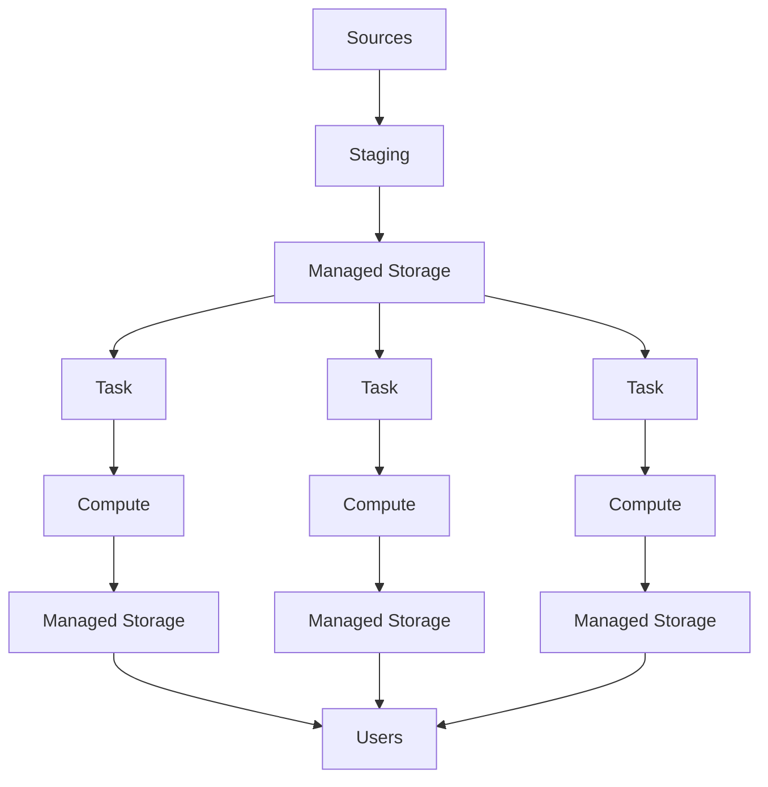

# example-pipeline-project

Example data pipeline project structure with modern Python tooling.

## Subject

- CSV file for simplicity
- Invalid data needing corrections
- Target format requirement data manipulation
- Task failure due to unexpected data

This project follows a traditional data flow pattern.



## The Data

This project processes shipment data from a denormalized, queried format.

|route_id|order_id                     |sku_id|origin_id                                    |origin_city |origin_state|origin_zip|origin_country|dest_id|dest_city|dest_state|dest_zip|dest_country|weight            |weight_uom|quantity         |quantity_uom|linehaul_cost      |linehaul_cost_uom|
|--------|-----------------------------|------|---------------------------------------------|------------|------------|----------|--------------|-------|---------|----------|--------|------------|------------------|----------|-----------------|------------|-------------------|-----------------|
|72      |465                          |292   |1                                            |Philadelphia|PA          |20134     |US            |2      |Vancouver|BC        |ABC DFG |CA          |279.429           |LBS       |3.2372           |PLT         |-344.4967          |USD              |

## Usage

### Run Jobs

```shell
python run.py jobs --offline
```

### For Help

```sh
# dev commands
make help

# general run.py help
python run.py --help

# check help messages for each subcommand
python run.py jobs --help
```
